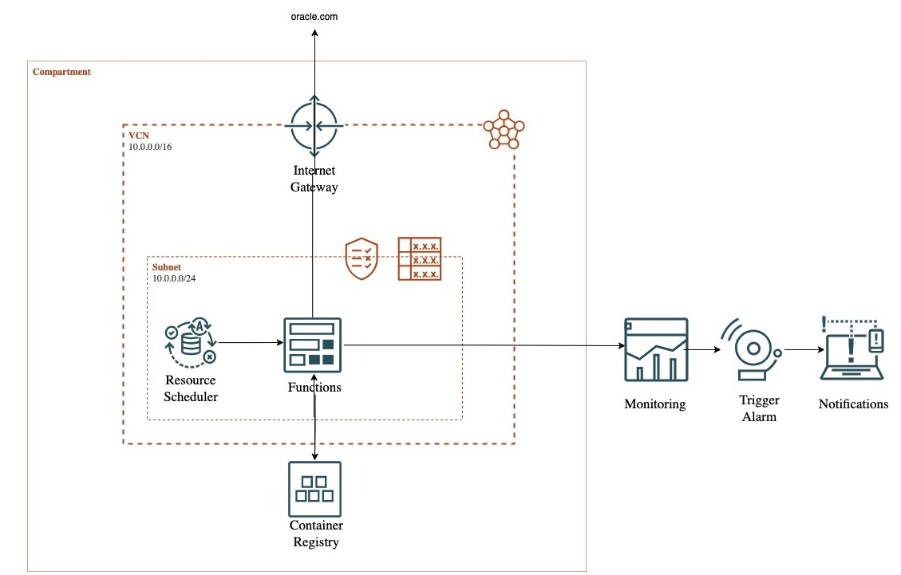

# Certificate Expiration Monitoring with OCI Function

Monitor SSL certificate expiration and publish data to Oracle Cloud Infrastructure (OCI) Monitoring.

## Overview

This OCI Function calculates the number of days remaining until an SSL certificate expires for a specified endpoint and publishes the metric to OCI Monitoring.



## Prerequisites

1. **OCI Tenancy**: Access to an OCI tenancy with required permissions.
   - Resource Creation: Before proceeding with group creation and policies, you must first create the required resource (e.g., an OCI Function or a Resource Scheduler) and obtain its OCID.
2. **OCI Function Creation**:
    - Deploy the function using OCI's Functions service.
    - Obtain the function's OCID.
3. **Dynamic Group Setup**:
    - Create a dynamic group (`CertMonitoringFunc-DG`) to include your function's OCID:
      ```text
      ANY {resource.id = '<ocid1.fnfunc.oc1...>'}
      ```
    - Create dynamic group (`ResourceScheduler-DG`) including your resource scheduler OCID:
      ```text
      ALL {resource.type='resourceschedule', resource.id ='ocid1.resourceschedule.oc1>'}
      ```
4. **IAM Policies**:
    - Grant permissions to the dynamic group:
      ```text
      Allow dynamic-group CertMonitoringFunc-DG to manage metrics in compartment <compartment_name>
      Allow dynamic-group CertMonitoringFunc-DG to read functions-family in compartment <compartment_name>
      ```
   - Add a policy to enable the dynamic group to trigger OCI function
      ```text
      Allow dynamic-group ResourceScheduler-DG to manage functions-family in compartment <compartment_name>
      ```
5. **Environment Variables**:
    - Configure the following variables for the function:
        - `ENDPOINTS`: A comma-separated list of endpoints (e.g., `example.com,service.com`).
        - `NAMESPACE`: The custom namespace for OCI Monitoring metrics (e.g., `CertificateMonitoring`).
        - `METRIC_NAME`: The name of the metric to be published (e.g., `CertificateExpiryDays`).

6. **View Custom Metrics**: After the function runs for the first time and pushes custom metrics to Monitoring, you can view the results in the Metrics Explorer by selecting the relevant `Compartment`, `Metric Namespace`, and `Metric Name`.
7. **Create Alarms**: As the next step, create an appropriate alarm to monitor the custom metrics and configure the delivery method, such as email, to receive notifications.

## Features

- **SSL Certificate Monitoring**:
    - Checks the number of days remaining until the SSL certificate expires for specified endpoints.
    - Ensures proactive monitoring to avoid service disruption.
- Logs with timestamps and **error categories** for better debugging.
- Errors are clearly classified into:
    - **Connection failures**
    - **TLS handshake issues**
    - **Certificate retrieval failures**
- **OCI Monitoring Integration**:
    - Publishes custom metrics to OCI Monitoring for real-time analysis.
- **Retry Mechanism**:
    - Uses exponential backoff with jitter to improve reliability.
    - If a TLS handshake fails, the function retries **up to 3 times** with increasing wait times.
- **Concurrent Processing**:
    - Processes multiple endpoints in parallel to improve efficiency.
- **Timeout Handling**:
    - Uses context-based timeout to prevent long-running operations on unresponsive endpoints.
- **Graceful Handling of Partial Failures**
    - Even if some endpoints fail, the function **continues processing other endpoints**.
- **Metrics Publication**:
    - Publishes the metric data for each endpoint's certificate expiration.

## Usage Instructions

### Local Deployment (For Testing)

1. Clone the repository:
   ```bash
   git clone <repository_url>
   cd <repository_directory>
   ```

2. Ensure **Go 1.23+** is installed.

3. Set environment variables:
   ```bash
   export ENDPOINTS=example.com,service.com
   export NAMESPACE=CertificateMonitoring
   export METRIC_NAME=CertificateExpiryDays
   ```

4. Execute the function locally:
   ```bash
   go run main.go
   ```

### OCI Function Deployment

1. Build and deploy with Docker:
   ```bash
   docker build --platform=linux/amd64 -t <region_code>.ocir.io/<namespace>/certificate-check:v1.0.0 .
   docker push <region_code>.ocir.io/<namespace>/certificate-check:v1.0.0
   ```

2. Deploy the function to OCI Functions:
    - Specify the Docker image (`<region_code>.ocir.io/<namespace>/certificate-check:v1.0.0`) in the function configuration.

3. Invoke the function:
   ```bash
   oci fn function invoke --function-id <function_ocid> --body ""
   ```

## Workflow

1. **Endpoint Certificate Check**:
    - The function connects to each endpoint over TLS/SSL.
    - It retrieves the SSL certificate and calculates the days remaining until expiration.
2. **Metrics Client Initialization**:
    - A monitoring client is initialized using OCI's `ResourcePrincipalConfigurationProvider`.
3. **Metric Publishing**:
    - Metrics, including the number of days remaining for each endpoint's certificate expiry, are optionally published to OCI Monitoring.
4. **Logs and Results**:
    - Logs provide a summary of successful and failed operations, including any errors encountered.

## Metrics in OCI

- **Metric Name**: `CertificateExpiryDays` (or specified via the `METRIC_NAME` environment variable).
- **Namespace**: As specified by the `NAMESPACE` environment variable (e.g., `CertificateMonitoring`).
- **Dimensions**:
    - Each metric includes the `resourceId` dimension, identifying the monitored endpoint.

## Debugging and Error Handling

- **Common Issues**:
    - Ensure `ENDPOINTS` are in the correct format (`hostname1,hostaname2,hostname3`).
    - Confirm IAM policies are properly configured and propagated.
    - Check OCI Function logs for environment variable or permission errors.

- **Timeouts and Errors**:
    - If a timeout occurs or the endpoint returns an error, results and logs will indicate the failure:
      ```text
      Failed to process endpoint: <endpoint>, Error: <error_message>
      ```

- **Security**:
    - Avoid using `InsecureSkipVerify` for production deployments. Update the TLS configuration accordingly.